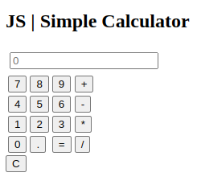
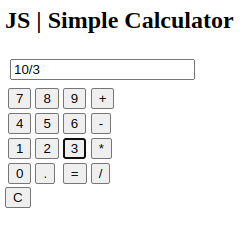
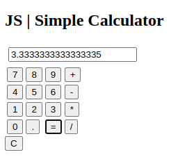
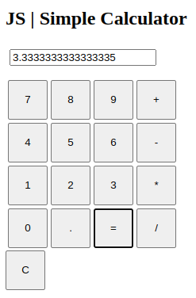
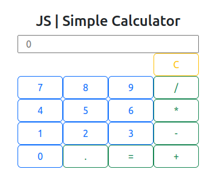
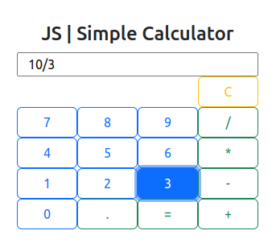
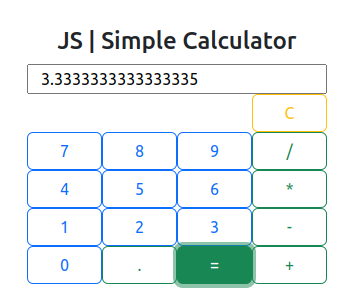

# JS | Simple Calculator v.0.1

Used technologies:

- HTML
- CSS
- Javascript

Here's a simple calculator in JavaScript that performs the four basic operations (addition, subtraction, multiplication, and division) and includes a "C" button to clear the data.

  
  

When you open the site in a web browser, you'll see a simple calculator interface with two input fields for numbers, buttons for each operation (+, -, *, /), and a "C" button to clear the data. The result of the calculation will be displayed below.

See the project by clicking on the link below.  
[JS Calculator](https://paulorabelo.github.io/js-simple-calculator/)

---
# JS | Simple Calculator v.0.2

Here's an updated version of the calculator in JavaScript that includes a full numeric keypad and a "C" button to clear the data.  

  
  
  

The updated calculator have a full numeric keypad with buttons from 0 to 9, a decimal point button (.), and buttons for each operation (+, -, *, /). The input field will display the result of the calculation, and you can perform multiple calculations by entering numbers and operators. The "C" button will clear the input field.  

See the project by clicking on the link below.  
[JS Calculator](https://paulorabelo.github.io/js-simple-calculator/)

---
# JS | Simple Calculator v.0.3
  

---  
# JS | Simple Calculator v.1

Used technologies:

- Bootstrap 5.3

Here's the updated version of the script.js file that refactors the calculator to prepare for the next calculation when finishing the current calculation by pressing the "=" button:  
 

  
  
  

In this updated version, I added a new variable called `resultadoNoDisplay` to keep track of whether the result is currently displayed. When the user starts entering a new calculation after pressing "=", the previous result will be cleared, and the calculator will be ready for the next calculation.

Now, when the `paraResultado` function is called, it checks if the result is currently displayed (`resultadoNoDisplay`). If it is, the input field is cleared, and the `resultadoNoDisplay` flag is set to false to indicate that a new calculation is being started.

Similarly, in the `calcular` function, after evaluating the expression and displaying the result, the `resultadoNoDisplay` flag is set to true to indicate that the result is currently displayed.

These changes ensure that when the user finishes a calculation and presses "=", the calculator is ready for the next calculation without requiring the user to manually clear the input field.

See the project by clicking on the link below.  
[JS Calculator](https://paulorabelo.github.io/js-simple-calculator/)