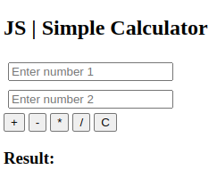
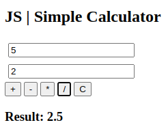

# JS | Simple Calculator v.1.0

Used technologies:

- HTML
- CSS
- Javascript

Here's a simple calculator in JavaScript that performs the four basic operations (addition, subtraction, multiplication, and division) and includes a "C" button to clear the data.

  
  

When you open the site in a web browser, you'll see a simple calculator interface with two input fields for numbers, buttons for each operation (+, -, *, /), and a "C" button to clear the data. The result of the calculation will be displayed below.

See the project by clicking on the link below.  
[JS Calculator](https://paulorabelo.github.io/js-simple-calculator/)

